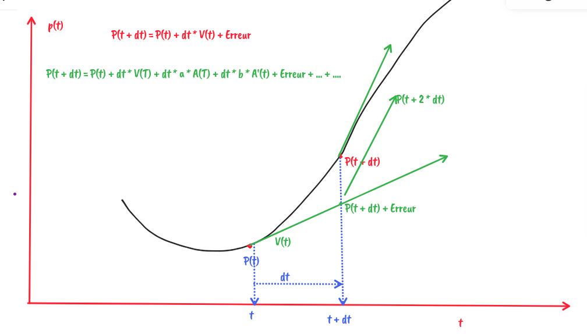

# Integration

```
a(t) = sum(forces) / mass

v'(t) = a(t)
p'(t) = v(t)
```

## Approximation

Méthode d'Euler explicite

```
a(t) = sum(forces) / mass

v(t + dt) = v(t) + dt * a(t) + O(dt^2)
p(t + dt) = p(t) + dt * v(t) + O(dt^2)
```

- Deux type d'erreur:
  - Erreur locale
  - Erreur globale, ou accumulée

- Developpement limité? https://en.wikipedia.org/wiki/Taylor_series

```
p(t + dt) = 
   p(t)
   + dt * v(t)
----

   + dt^2 / 2 * a(t)
   + dt^3/6 * a'(t)
   + dt^4/24 * a''(t)
   + ..
```





Digression: 1/sqrt(x)

normalize x = x / sqrt(dot(x, x))

Petit changement:

## Euler semi-implicite

```
a(t) = sum(forces) / mass

v(t + dt) = v(t) + dt * a(t) + O(dt^2)
p(t + dt) = p(t) + dt * v(t + dt) + O(dt^2)
```

## Euler implicite

```
a(t) = sum(forces) / mass

v(t + dt) = v(t) + dt * a(t + dt) + O(dt^2)
p(t + dt) = p(t) + dt * v(t + dt) + O(dt^2)
```

--> Voir les méthodes implicites, et enchainer sur RK

https://en.wikipedia.org/wiki/Runge%E2%80%93Kutta_methods

--> Methodes "stables" numériquement.

LeapFrog:


```
a(t) = sum(forces) / mass

v(t + 1 / 2 dt) = v(t - 1/2 dt) + dt * a(t) + O(dt^2)
p(t + dt) = p(t) + dt * v(t + 1/2 * dt) + O(dt^2)
```

## Verlet

```
(A)
p(t + dt) =
  p(t)
  + dt * v(t + dt)
   + dt^2 / 2 * a(t)
   + dt^3/6 * a'(t)
   + dt^4/24 * a''(t)
   + O(dt^5)
   + O(dt^6)
   + ...

(B)
p(t - dt) = 
  p(t)
  - dt * v(t + dt)
   + dt^2 / 2 * a(t)
   - dt^3/6 * a'(t)
   + dt^4/24 * a''(t)
   - O(dt^5)
   + O(dt^6)
   + ...

(A) + (B)

p(t + dt) + p(t - dt) = 
  2 * p(t)
  + dt^2 * a(t)

  + O(dt^4)


p(t + dt) =
  2 * p(t)
  - p(t - dt)
  + dt^2 * a(t)
  + O(dt^4)

v(t) = (p(t) - p(t - dt)) / dt


pt = p0
pt_minus_dt = p0

t = 0

while True:
  a = calcul_de_a
  (pt_minus_dt, pt) = (pt, 2 * pt - pt_minus_dt + dt ^ 2 * 2)
  t += dt


