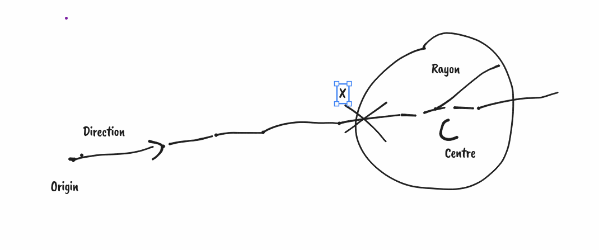

# Intersection between a ray and a sphere




```
Rayon:
   - origin
   - direction

Sphere:
   - center
   - radius

X


Sphere formula:
  dist(X, center) = radius

Line formula:
  X = Origin + t * Direction

  t >= 0

Use both formulas:
  dist(Origin + t * Direction, center) = radius

Length(Origin + t * Direction - center) = radius

let oc = Origin - Center

Length(oc + t * Direction) = radius

<=>
sqrt((oc_x + t * Direction_x) ^ 2
    +(oc_y + t * Direction_y) ^ 2
    +(oc_z + t * Direction_z) ^ 2) = radius

=>

    ((oc_x + t * Direction_x) ^ 2
    +(oc_y + t * Direction_y) ^ 2
    +(oc_z + t * Direction_z) ^ 2) = radius ^ 2

Let's develop first term

(oc_x + t * Direction_x) ^ 2

=

oc_x ^ 2 + t ^ 2 * Direction_x ^ 2 + 2 * oc_x * t * Direction_x

Let's apply that in global formula:


oc_x ^ 2 + t ^ 2 * Direction_x ^ 2 + 2 * oc_x * t * Direction_x
+ oc_y ^ 2 + t ^ 2 * Direction_y ^ 2 + 2 * oc_y * t * Direction_y
+ oc_z ^ 2 + t ^ 2 * Direction_z ^ 2 + 2 * oc_z * t * Direction_z

= radius ^ 2

Group by t factor:


t ^ 2 * (length(Direction) ^ 2)
+ 2 * t * dot(oc, Direction)
+ length(oc) ^ 2
= radius ^ 2

Move radius factor:

t ^ 2 * (length(Direction) ^ 2)
+ 2 * t * dot(oc, Direction)
+ length(oc) ^ 2
- radius ^ 2
= 0
```

```
let oc = Origin - Center
let A = length(Direction) ^ 2
let B = 2 * dot(oc, Direction)
let C = length(oc) ^ 2 - radius ^ 2

t ^ 2 * A + t * B + C = 0

delta = B ^ 2 - 4 * A * C

si delta > 0
  t = (-B - sqrt(delta)) / (2 * A)
  t = (-B + sqrt(delta)) / (2 * A)
si delta == 0
  t = -B / (2 * A)
si delta < 0
  no intersection
```

Notes:

- check that `t >= 0`, otherwise you'll get intersection behind the camera.
- Pick the smallest `t` possible
- Some simplificaitons are possible (if `length(Direction) == 1`)
- `length(x)` can be implemented as `sqrt(dot(x, x))`
- `length(x) ^ 2` is hence `sqrt(dot(x, x)) ^ 2` which is just `dot(x, x)`,
  with optimised out sqrt and sq. This may be a good optimisation. You can even
  introduce a `length_squared` function.

# Optimisation discussion

Here is our reference code (I special-cased the case where `delta == 0` which
is handled by first case, e.g. `sqrt(0) = 0`. This is a micro optimisation, but
the case where `delta = 0` is so rare, that it actually simplifies code. This
should be benchmarked actually.

I also simplified `length(x) ^ 2` to `length2(x)`

```


let oc = Origin - Center
let A = length2(Direction)
let B = 2 * dot(oc, Direction)
let C = length2(oc) - radius ^ 2

equation: 
t ^ 2 * A + t * B + C = 0

let delta = B ^ 2 - 4 * A * C

if delta >= 0
  let t = (-B - sqrt(delta)) / (2 * A)
  let t' = (-B + sqrt(delta)) / (2 * A)
else
  no intersection
```

If we enforce that the ray direction is normalized (can be enforced at ray
creation time), then `length(Direction) = 1` and hence `A = 1`, then everything
simplifies:

(This saves a few multiplications and additions)

```
let oc = Origin - Center
let B = 2 * dot(oc, Direction)
let C = length2(oc) ^ 2 - radius ^ 2

equation: t ^ 2 + t * B + C = 0

let delta = B ^ 2 - 4 * C


if delta >= 0
  t = (-B - sqrt(delta)) / 2
  t' = (-B + sqrt(delta)) / 2
else
  no intersection
```

Now, look at the `/ 2` factor in the computation of `t`. We can inject it into the upper formulas:

```
t = (- B - sqrt(delta)) / 2
  = (- (B/2) - sqrt(delta/4))
  = - B' - sqrt(delta')

let B' = B/2
let delta' = delta / 4
```

Hence, we can simplify the `delta` computation, if instead we use `delta'` and `B'`

```

let oc = Origin - Center
let B = 2 * dot(oc, Direction)
let B' = B/2
    B' = dot(oc, Direction)
let C = length2(oc) ^ 2 - radius ^ 2

equation: t ^ 2 + t * B + C = 0

let delta = B ^ 2 - 4 * C
    delta' = delta / 4
           = (B/2) ^ 2 - C
           = B' ^ 2 - C
```

Finally, we get the following:

```
let oc = Origin - Center
let B' = dot(oc, Direction)
let C = length2(oc) ^ 2 - radius ^ 2

equation: t ^ 2 + t * B + C = 0

let delta' = B' ^ 2 - C


if delta' >= 0
  t = -B' - sqrt(delta')
  t' = -B' + sqrt(delta')
else
  no intersection
```

And this saves a few multiplications and divisions.

# Reference

- sympy
