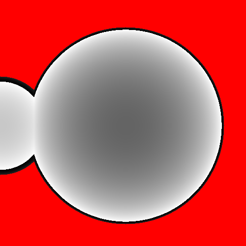
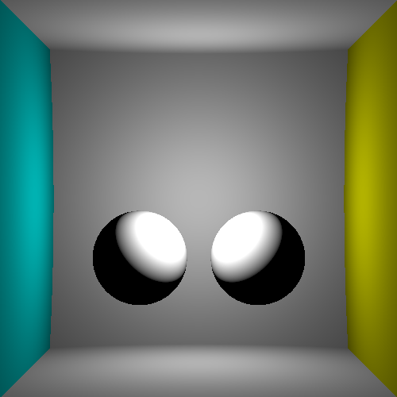
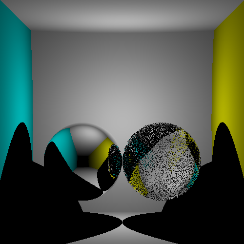
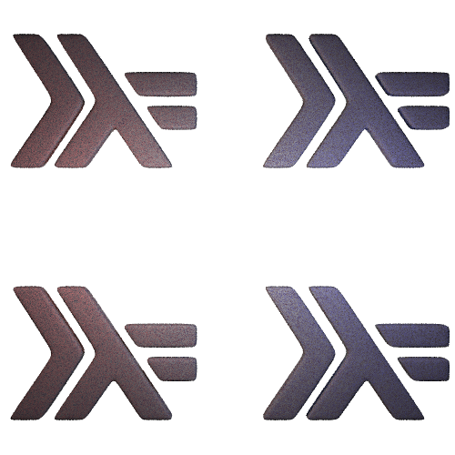

# Raytracing

During this course, you'll see the basics of image sythesis, especially what
are the object involved (light, camera, surfaces, volumes), light transport
(e.g. ray tracing), optimisation structures (scene hierarchy), basics of color
theory, sampling, ...

# Grades

I'm not really focused on grading you, you'll have a QCM at the end of the
course in order to get an idea of what information you got from the course.

# Programming language

Use whatever you want, I don't care as long as you are efficient with it. This
is NOT a programming course, but I may focus on some programming tips for the
purpose of the course. I'll also discuss about computer science and
engineering, applied to image rendering.

# What you should know before doing this course

This is not a programming course. Be current with any programming language you
want, setup your programming environment so you will be able to program
efficiently and write efficient program.

Know about version control, testing (testing your ray/sphere intersection code
in a minimum!), debugging, profiling.

# Contents

We have 30h. Most of this will be focus on implementing a ray tracing engine.
Here is a rough draft of the session we'll have, but order and content will
adapt based on your progress.

## Depth

We'll write our first simple camera model, as well as ray/sphere intersection
logic. We should be able to compute a depth image of a scene composed of a few
spheres.

## Light transport: direct lighting, surface behavior

At intersection point, we'll compute the amount of light from directly visible
light and scattered by surface toward the camera.

And also take into account basic visibily (e.g. is the light able to lit the surface)

## Light transport: indirect lighting (glass, mirors). Sampling introduction

We'll shoot indirect rays in order to compute indirect lighting (e.g. what is
happening after a few bounces). We'll discuss performance of an exhaustive
tracing of all rays (in glass, each bounce generates two rays, so quickly we'll
end up with a too large numbers of rays).

We'll then introduce sampling, monte-carlo, multiple importance sampling and
discuss how it can help implementing a few phenomena:

- "anti-aliasing"
- Depth of field
- Motion blur
- Complex light sources
- Volumes
- "Accurate" wavelength simulation
- Indirect lighting

## Light transport: more sampling (indirect diffuse lighting, lamps, ...)

We'll focus on implementing a few effects which requires sampling. The minimum
will be indirect diffuse lighting, but "the sky is the limit".

## Optimisation structures: more objects, maybe triangles

Ray/scene intersection is `O(n)` (n being the number of objects). If we shoot
multiples ray per pixel, on multiples pixel, on scenes composed of billions of
objects, that's impossible. Introducing acceleration structures which makes
that possible.

This will also be the opportunity to discuss transformations matrix in order to
build complex scenes.

## Advanced light transport

In this advanced section, we'll discuss some advanced light transport
algorithms, such as bidirectional path tracing, photon mapping, multiples
importance sampling, ...

## More

We'll take a bit of time to discuss performance (parallelism, efficient code,
...) because that's one field where performance really matter.

All the theory in this course will be then applied to the next course,
real-time rendering, which will leverage GPU / rendering pipeline to render
image in real time. Some (if not all) of the notions leaned will still apply,
but with more constraint (e.g. how do we do that with a GPU).

# References

- https://raytracing.github.io/books/RayTracingInOneWeekend.html compact
  implementation of a raytracing engine. Contains super nice schemas, code
  samples and details. The final renedred scene is what we want to achieve
  before the end of this course
- https://raytracing.github.io/ the serie of books, you have everything you need.
- https://pbrt.org/ this is the course book reference, it contains everything
  (and more) about rendering.
- https://www.cs.cornell.edu/courses/cs6620/2009sp/Homework/hw2/GICompendium.pdf
  contains a few relevant formulas.
- https://github.com/guibou/streamray this is an implementation of this course
  that I've done in Haskell on twitch, see https://www.twitch.tv/FlyingGuibou
