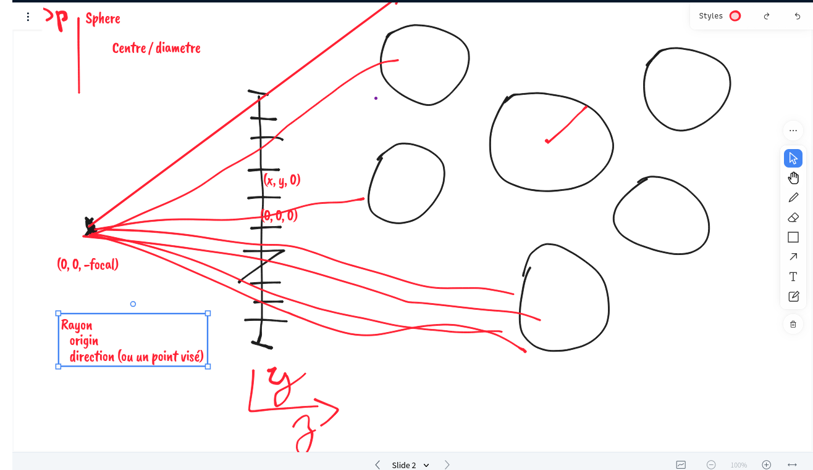
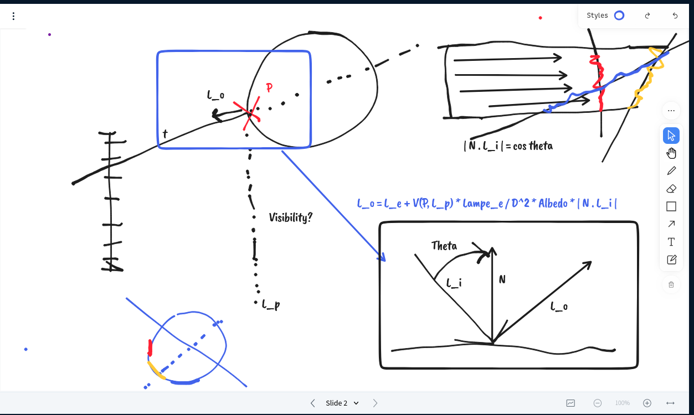
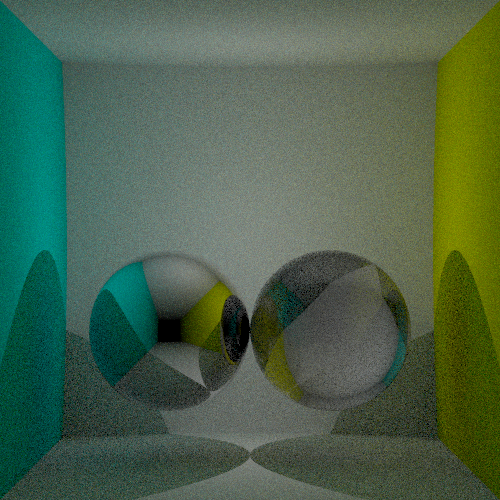
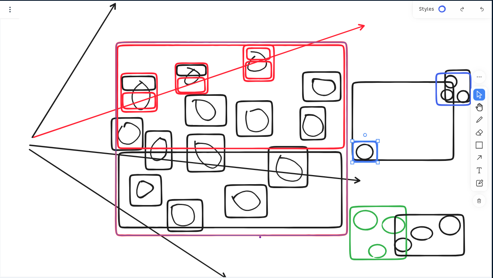

# Raytracing

During this course, you'll see the basics of image sythesis, especially what
are the object involved (light, camera, surfaces, volumes), light transport
(e.g. ray tracing), optimisation structures (scene hierarchy), basics of color
theory, sampling, ...

# Grades

I'm not really focused on grading you, you'll have a QCM at the end of the
course in order to get an idea of what information you got from the course.

# Programming language

Use whatever you want, I don't care as long as you are efficient with it. This
is NOT a programming course, but I may focus on some programming tips for the
purpose of the course. I'll also discuss about computer science and
engineering, applied to image rendering.

# What you should know before doing this course

This is not a programming course. Be current with any programming language you
want, setup your programming environment so you will be able to program
efficiently and write efficient program.

Know about version control, testing (testing your ray/sphere intersection code
in a minimum!), debugging, profiling.

# Contents

We have 30h. Most of this will be focus on implementing a ray tracing engine.
Here is a rough draft of the session we'll have, but order and content will
adapt based on your progress.

## Depth


We'll write our first simple camera model, as well as ray/sphere intersection
logic. We should be able to compute a depth image of a scene composed of a few
spheres.




See [](./IntersectionRayonSphere.md) for details about the ray/sphere intersections.

See [](./TypeSafety.md) for discussion about undefined behavior and how to type
functions (e.g. `intersect_ray_sphere`) so you are less at risk of coding
something wrong.

### Tone mapping

Our first implementation computes the depth of the sphere. However, this depth
is between `0` and infinity, so how do we store that in the finale image (which accepts values between 0 and 255 on each channel)

This problem is known as tonemapping, and there is no good solution.

In photography, that's either done automatically by your device which pick a
correct exposure in order to have a picture which is not too dark neither too
bright.

You can also manually decide what exposure you'll use.

Then, you can, later, in a postprocessing tool, also decide how the values
between the min and max are remapped, in order to brighten the darks and darken
the lights.

The question is to implement the function `RealMeasure -> StoredValue`.

For now, we implemented a naive function. Values are linearly mapped between 0
and a fixed threshold to `[0..255]` and values above are clamped.

In the future, we may compute the threshold by picking the maximum value of the
pixels (need a temporary buffer) and then doing the conversion.

# Exercices

- Implement the raytracing engine so you can display the depth of a sphere
- Implements many spheres (e.g. a list of spheres). Please ensure that depth is correct when spheres overlaps.
- Implements an automated tone-mapper for your depth: it picks the largest
  depth and maps it to 255, and the smallest depth is mapped to 0. What to do
  when there is no intersection? Suggestion: map intersection to greyscale, and
  for no intersection, use a nice pinkish color.

## Light transport: direct lighting, surface behavior





We want to compute light on point `P = Ray.origin + t * Ray.direction`.

We'll get into details later, but for now:

```
L_o = L_e + V(P, L_p) * L_emit / D ^ 2 * Albedo * | N . L_i |
```

Where:

- `L_o` is the light outgoing from the surface, which is composed of:
  - `L_e` the light emited by the surface
  - The light `L_i` incoming to the surface, transfered by the 

The light `L_i` depends on:

- the visibility, can we see the point light. `V(P, L_p)`.
- the quatity of light emited by the light `L_emit`
- the distance to the light `1 / D^`
- The quantity of light transfered by the surface, `Albedo` (e.g. the "color" of the surface).
- The "form factor", e.g. `N . L_i` where `N` is the normal to the surface.

Notes:

- This is a simplification of light transfert, with a unique point light and a
  "Lambertian" surface which reflect light the same in all direction.
- Later, the `Albedo` could be turned into a function which depends on the incoming and outgoing vector, light wavelength, time, ...
- `ALbedo` is an amount transmitted, so between 0 and 1
- `L_emit` is a quantity of light, so >= 0, but not bounded.


At intersection point, we'll compute the amount of light from directly visible
light and scattered by surface toward the camera.

And also take into account basic visibily (e.g. is the light able to lit the surface)


## Exercices

- Implemnt direct lighting over a few objects with at least one point light
- How does it behaves with multiples lights ? (Hint: light is "additive")
- Implement different objet "color"
- Implement visibility: shot a ray from `P` toward `L_p` and see if there is
  any intersection *BETWEEN* the surface and the light. You'll see some weird
  noise, that's normal. Do you know why?

## Light transport: indirect lighting (glass, mirors). Sampling introduction


We'll shoot indirect rays in order to compute indirect lighting (e.g. what is
happening after a few bounces). We'll discuss performance of an exhaustive
tracing of all rays (in glass, each bounce generates two rays, so quickly we'll
end up with a too large numbers of rays).

We'll then introduce sampling, monte-carlo, multiple importance sampling and
discuss how it can help implementing a few phenomena:

- "anti-aliasing"
- Depth of field
- Motion blur
- Complex light sources
- Volumes
- "Accurate" wavelength simulation
- Indirect lighting

## Light transport: more sampling (indirect diffuse lighting, lamps, ...)




We'll focus on implementing a few effects which requires sampling. The minimum
will be indirect diffuse lighting, but "the sky is the limit".

## Optimisation structures: more objects, maybe triangles




Ray/scene intersection is `O(n)` (n being the number of objects). If we shoot
multiples ray per pixel, on multiples pixel, on scenes composed of billions of
objects, that's impossible. Introducing acceleration structures which makes
that possible.

This will also be the opportunity to discuss transformations matrix in order to
build complex scenes.

## Advanced light transport

In this advanced section, we'll discuss some advanced light transport
algorithms, such as bidirectional path tracing, photon mapping, multiples
importance sampling, ...

## More

We'll take a bit of time to discuss performance (parallelism, efficient code,
...) because that's one field where performance really matter.

All the theory in this course will be then applied to the next course,
real-time rendering, which will leverage GPU / rendering pipeline to render
image in real time. Some (if not all) of the notions leaned will still apply,
but with more constraint (e.g. how do we do that with a GPU).

# References

- https://raytracing.github.io/books/RayTracingInOneWeekend.html compact
  implementation of a raytracing engine. Contains super nice schemas, code
  samples and details. The final renedred scene is what we want to achieve
  before the end of this course
- https://raytracing.github.io/ the serie of books, you have everything you need.
- https://pbrt.org/ this is the course book reference, it contains everything
  (and more) about rendering.
- https://www.cs.cornell.edu/courses/cs6620/2009sp/Homework/hw2/GICompendium.pdf
  contains a few relevant formulas.
- https://github.com/guibou/streamray this is an implementation of this course
  that I've done in Haskell on twitch, see https://www.twitch.tv/FlyingGuibou
