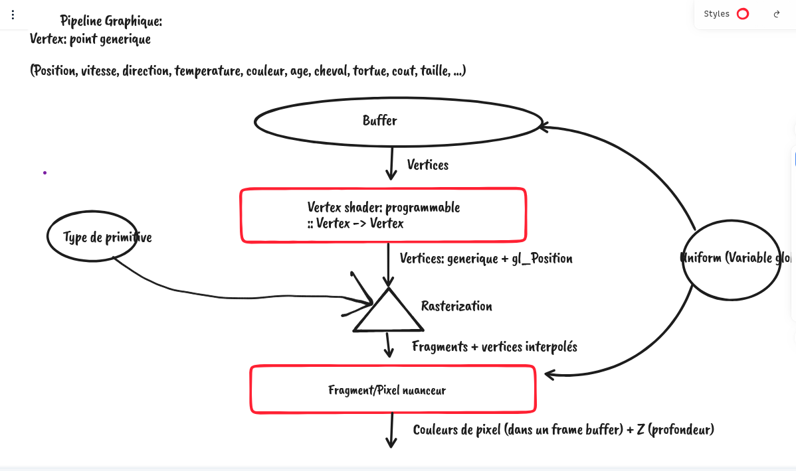

# Temps réel

- Image Temps réel <=> performance

- GPU
- Hardware specifique pour le graphique
  - SSE / AVX / ... => SIMD
  - Hardware spécifique
    - Hautement parallel
    - SIMD
      - CPU: cores "autonomes"
      - GPU: cores "pas autonomes"
        - Simple Instrcution Multilpe Data


Les conditions "blokent" et "attendent".

```
if(toto)
   tata
else
   titi
```

Comment occuper tous les cores en même temps?

==> Faire tout le temps la même chose.
==> Ensemble d'operation "trop lente en software" (ou critique) => hardware.

Dessiner une ligne: rasterization


- Fragment/pixel shader
  - Bosser sur le contenu du pixel


```
for x in largeur_image:
  for y in largeur_image:
      pixel(x, y) = fragmentShaderCode(x, y)
```

On va écrire `fragmentShaderCode`

```
color fragmentShaderCode(int x, int y)
{
....
}
```

Half-life. 3dfx

==> Max Payne. "Hardware transform and lighting"

Le graphisme sur GPU c'est:

- Un ensemble d'operation "fixes"
- Un ensemble d'operation "programmables": les SHADERS (le "nuanceurs").


# Le pipeline graphique




# API graphique

- La librairie (coté CPU) qui sert à programmer le GPU.


Libraries:

  - OpenGL
  - DirectX 3D
  - Vulkan
  - Metal


# Libraires outils

- SDL:
  - Gestion des feneters
    SDL ouvre la fenetre, OpenGL dessine dedans
  - Chargement de texture
  - Gestion des perphierques (joystick, clavier, souris)
- Pygame
  - "Moteur de jeu"
  - Interface "high level" au dessus d'opengl

# Historique

## OpenGL

OpenGL 2: "librairie moteur de jeu"
  - Pipeline "fixe"
  - Notion de lumière
  - Notion de transformation (matrice, ...)
  - Librairie "haut niveau"
OpenGL 3:
  - "aka" "La grande deception"
  - Mixe immonde entre bas level et haut level
OpenGL 3.3:
  - Bon nettoyage + geomtry shader
OpenGL 4 (et 4+):
  - Direct state acccess + tesselation shader + compute shader

Faites de l'OpenGL 4!

Pour le web: Opengl ES (~ opengl 3), WebGPU (je connais pas!)

## DirectX

<= 9
- Ressemble pas mal à OpenGL 
> 9
- Plus bas level: grosse remise à plat


===> Conclusino: drivers extrement complexe, et les dev ont peut de controle.

--> DirectX > 9
--> Vulkan

# Ce cours: de l'OpenGL

- Comment ouvrir un context OpenGL (sdl, glfw, ...)

- Pour afficher un truc, va falloir:

  - Créer et remplir un buffer (VBO) qui contient les données
  - Créer 1 program (composé d'au moins 2 shaders: vertex et frgament)
  - Créer un VAO (truc qui dit au program comment lire les buffers)
  - Parametrer le framebuffer (e.g. l'image!)
  - Dire ce que on veut dessiner (1 triangle depuis le buffer)


--> RenderDoc
--> Apitrace
--> https://learnopengl.com/


ATTENTION: glBegin/glEnd
--> tuto avant 2008


--> AVANT ;) Transformation / matrices
    --> Corus sur les matrices (jeudi matin).


--> Avoir un context openGL ouvert
